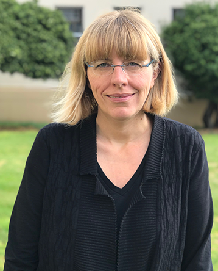

Title: TBA

Corina Păsăreanu, Carnegie Mellon University, USA

**Abstract**: TBA

**Bio**: Corina Pasareanu is an ACM Fellow working at NASA Ames. She is
affiliated with KBR and Carnegie Mellon University's CyLab. Her
research interests include model checking, symbolic execution,
compositional verification, AI safety, autonomy, and security. She is
the recipient of several awards, including an ETAPS Test of Time Award
and an ACM Impact Paper Award.  She has been serving as
Program/General Chair for several conferences, including CAV in 2015
and more recently, ICSE in 2025. More information can be found on her
website: [https://www.andrew.cmu.edu/user/pcorina/](https://www.andrew.cmu.edu/user/pcorina/)